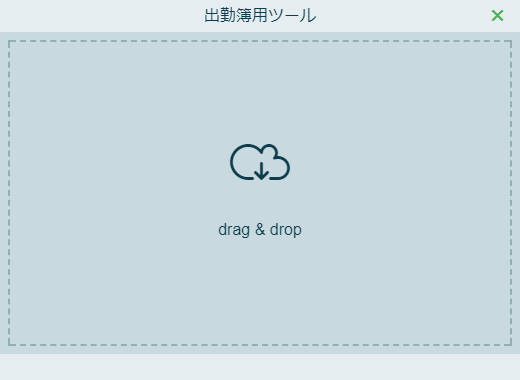
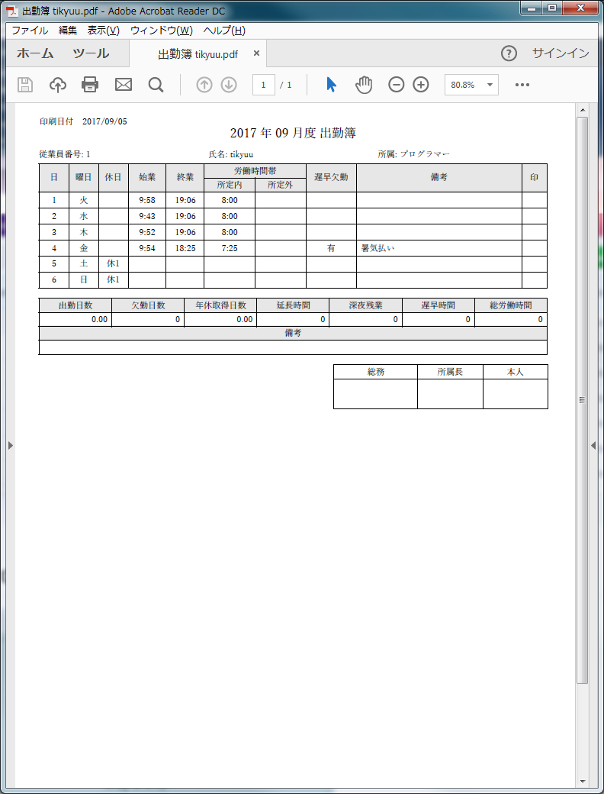

# electronで出勤簿用のpdf作ってみた。

  


## 使い方
インストール
- git
- nodejs (or nodist)


```bash
$ git clone https://github.com/tikyuu/electron-pdfmake.git
$ cd electron-pdfmake
$ npm update
$ npm dedupe

### electron 実行 test.jsonをドラッグ&ドロップする。
$ npm start

### 配布用exe 作成
$ npm run release
```

## 出会った問題点
  日付取得用のモジュールを使ったらなんかエラーが出た。<br>
  electronと相性が悪いのかも。他のモジュールでもそういうのありそう。<br>
  `npm i -D date-utils ✖`

  TypeScriptで書くと定義ファイル作るのがめんどい。のでes6で書く。

  pdfmakeなんか書くのめんどい。

  ファイル名が長すぎて削除できないとか言われたら、<br>
  `npm dedupe`<br>
  を一旦やってみる。

  最終的なファイル出力がごちゃごちゃしているので、1つのexeにまとめるために、<br>
  [Enigma Virtual Box](http://qiita.com/takumi918/items/acf35685f5d68653c030)を使っている。が、設定がめんどくさい。<br>

## 参考
[javascriptで日付フォーマッタ](http://qiita.com/egnr-in-6matroom/items/37e65bb642d2e158804c)  
[Drag and Drop File Uploading](https://css-tricks.com/drag-and-drop-file-uploading/)  
[BrowserWindow](https://xwartz.gitbooks.io/electron-gitbook/content/en/api/browser-window.html)  
[Electron APP packaging](https://stackoverflow.com/questions/39063795/electron-app-packaging)  
[pdfmkae playground](http://pdfmake.org/playground.html)  
[Electron製のアプリ、ごちゃごちゃしたファイル群を一つのEXEにまとめる方法](http://qiita.com/takumi918/items/acf35685f5d68653c030)  


